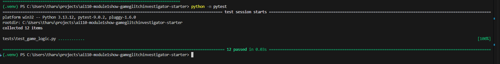
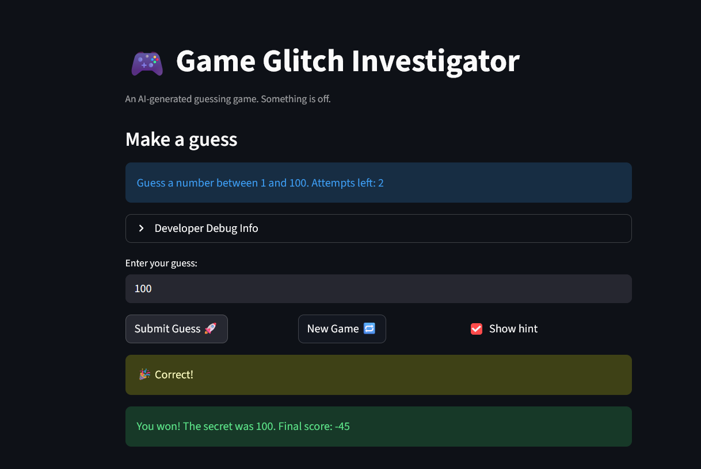

# 🎮 Game Glitch Investigator: The Impossible Guesser

## 🚨 The Situation

You asked an AI to build a simple "Number Guessing Game" using Streamlit.
It wrote the code, ran away, and now the game is unplayable. 

- You can't win.
- The hints lie to you.
- The secret number seems to have commitment issues.

## 🛠️ Setup

1. Install dependencies: `pip install -r requirements.txt`
2. Run the broken app: `python -m streamlit run app.py`

## 🕵️‍♂️ Your Mission

1. **Play the game.** Open the "Developer Debug Info" tab in the app to see the secret number. Try to win.
2. **Find the State Bug.** Why does the secret number change every time you click "Submit"? Ask ChatGPT: *"How do I keep a variable from resetting in Streamlit when I click a button?"*
3. **Fix the Logic.** The hints ("Higher/Lower") are wrong. Fix them.
4. **Refactor & Test.** - Move the logic into `logic_utils.py`.
   - Run `pytest` in your terminal.
   - Keep fixing until all tests pass!

## 📝 Document Your Experience

- [] Describe the game's purpose.
  A number guessing game where you try to guess a secret number within a limited number of attempts. The game gives you hints after each guess to guide you higher or lower, and tracks your score based on how quickly you find the answer.

- [] Detail which bugs you found.
  - The hints were backwards. Guessing too high told you to go higher, and guessing too low told you to go lower.
  - On even-numbered attempts, the secret number was secretly converted to a string, so comparisons like 9 vs 78 broke because "9" is greater than "78" as text.
  - Clicking "New Game" after winning or losing would not actually start a new game. The page looked frozen until you manually refreshed the browser.

- [] Explain what fixes you applied.
  - Swapped the hint messages in check_guess so "Too High" says go lower and "Too Low" says go higher.
  - Removed the string cast on even attempts so the secret is always compared as a number.
  - Added status = "playing" and history = [] to the New Game handler so the game properly resets without needing a page refresh.
  - [] Challenge 1: Pytest screenshot: 

## 📸 Demo

- [ ] 

## 🚀 Stretch Features

- [ ] [If you choose to complete Challenge 4, insert a screenshot of your Enhanced Game UI here]
